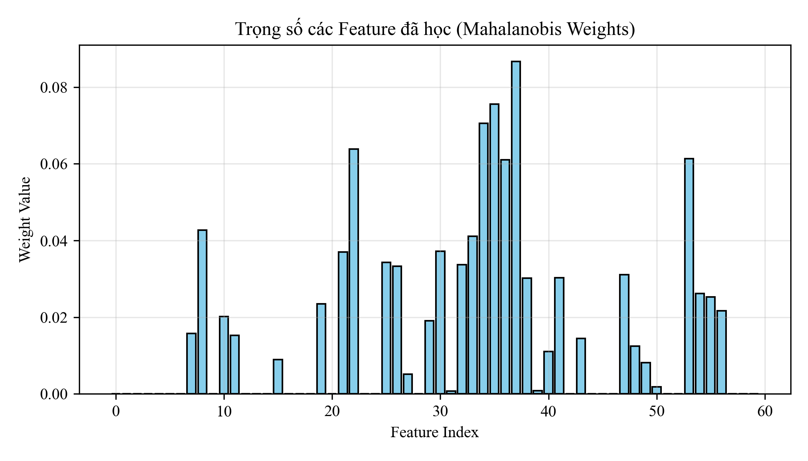
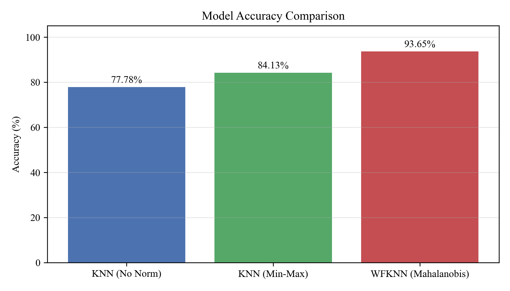
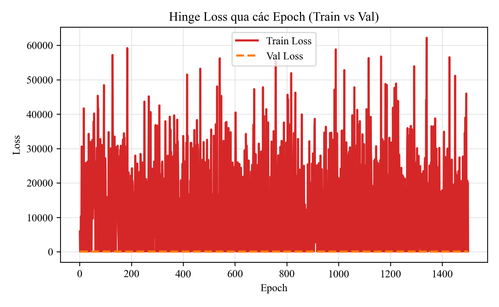
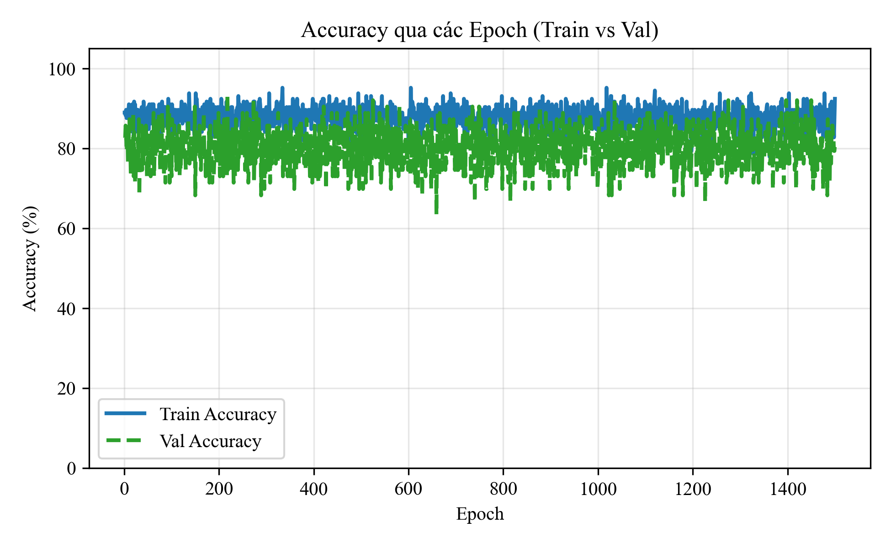
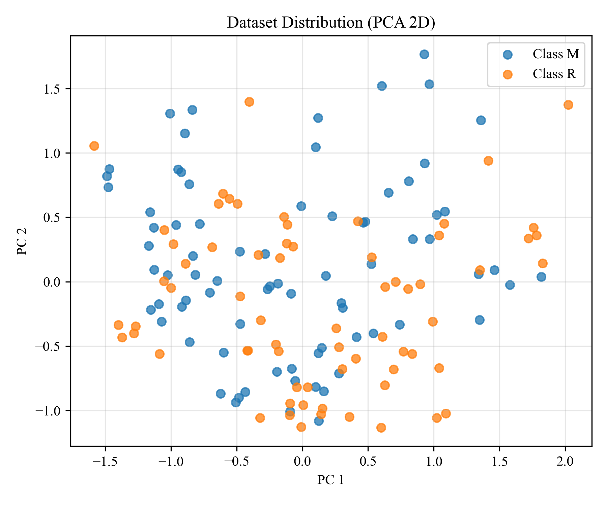
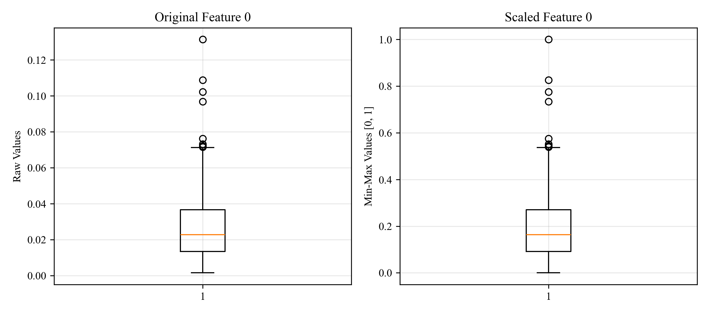
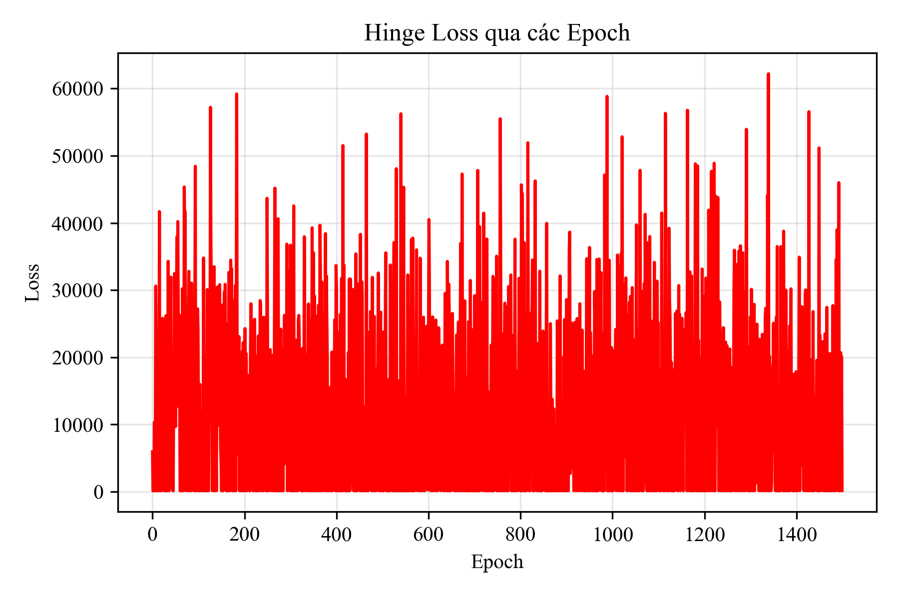
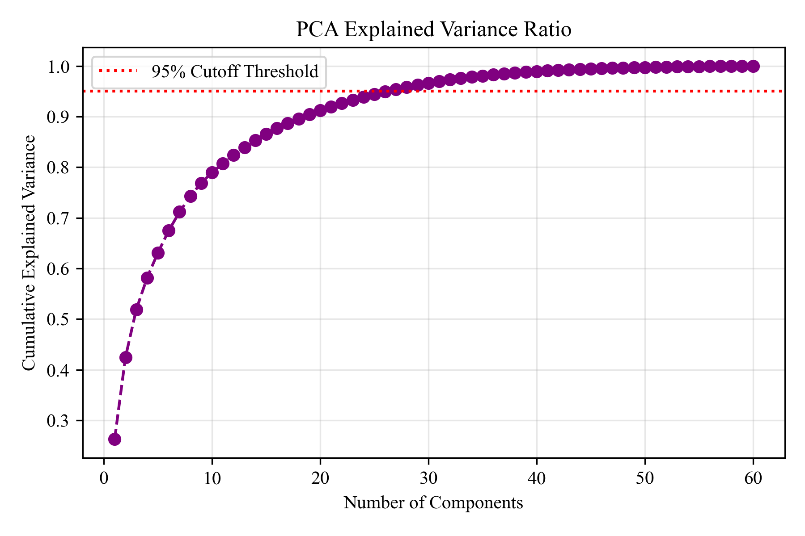
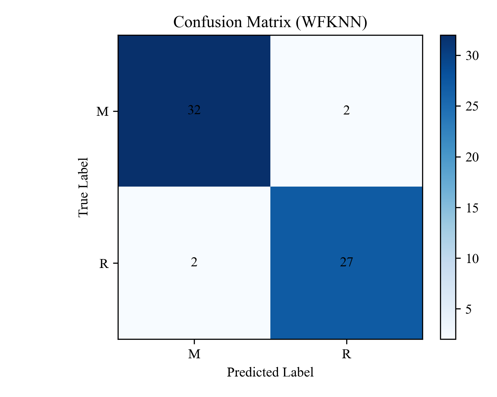
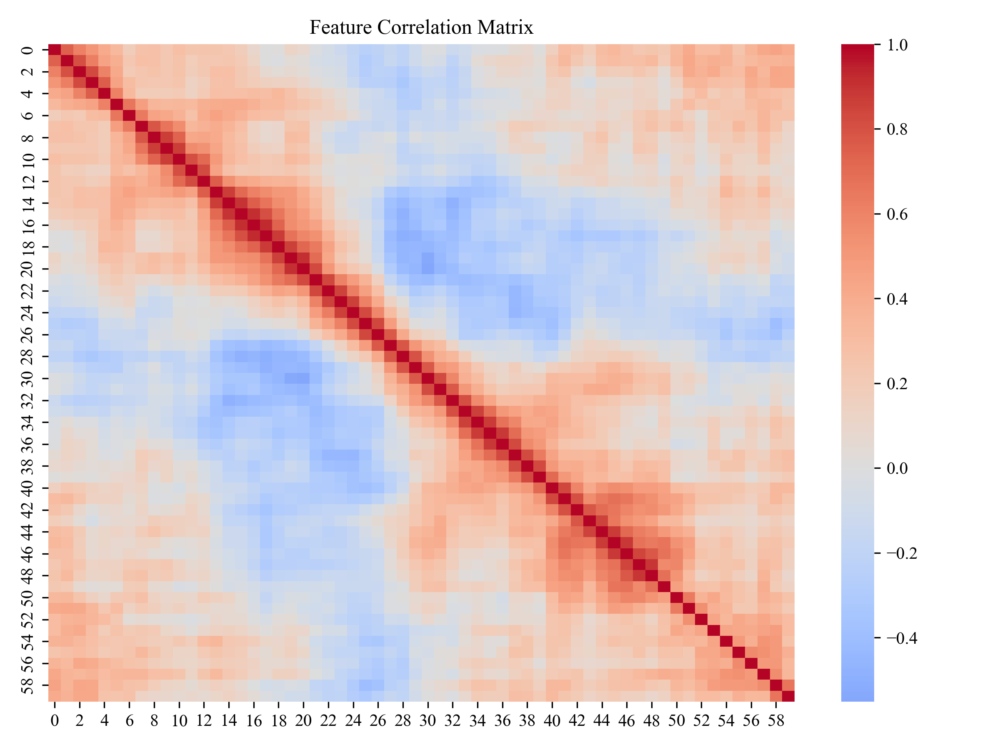

<h2 align="center">
  Author: Huynh Thanh Phong (ReoRioll)
</h2>

<p align="center">
   Computer Science of College of Information and Communication Technology of Can Tho University (Course 48)<br>
</p>

<p>
&nbsp;&nbsp;&nbsp;&nbsp;&nbsp;&nbsp;&nbsp;&nbsp;&nbsp;&nbsp;&nbsp;&nbsp;&nbsp;&nbsp;&nbsp;&nbsp;&nbsp;&nbsp;
<b>Researchs:</b> Artificial Intelligence in Education - Mathematics in Deep Learning and Machine Learning<br>

&nbsp;&nbsp;&nbsp;&nbsp;&nbsp;&nbsp;&nbsp;&nbsp;&nbsp;&nbsp;&nbsp;&nbsp;&nbsp;&nbsp;&nbsp;&nbsp;&nbsp;&nbsp;
<mark><b><b>Name Project:</b></b> </mark> WFKNN: Weighted-Feature K-Nearest Neighbors<br>


&nbsp;&nbsp;&nbsp;&nbsp;&nbsp;&nbsp;&nbsp;&nbsp;&nbsp;&nbsp;&nbsp;&nbsp;&nbsp;&nbsp;&nbsp;&nbsp;&nbsp;&nbsp;
<b>Timeline:</b> 03/2026 at Computer science department
</p>
<p align="center">
   <b>Presional link Information</b>
</p>

<p>
&nbsp;&nbsp;&nbsp;&nbsp;&nbsp;&nbsp;&nbsp;&nbsp;&nbsp;&nbsp;&nbsp;&nbsp;&nbsp;&nbsp;&nbsp;&nbsp;&nbsp;&nbsp;
Facbook: https://www.facebook.com/huynh.thanh.phong.561667 <br>

&nbsp;&nbsp;&nbsp;&nbsp;&nbsp;&nbsp;&nbsp;&nbsp;&nbsp;&nbsp;&nbsp;&nbsp;&nbsp;&nbsp;&nbsp;&nbsp;&nbsp;&nbsp;
Kaggle: https://www.kaggle.com/reorioll <br>

&nbsp;&nbsp;&nbsp;&nbsp;&nbsp;&nbsp;&nbsp;&nbsp;&nbsp;&nbsp;&nbsp;&nbsp;&nbsp;&nbsp;&nbsp;&nbsp;&nbsp;&nbsp;
Youtobe: https://www.youtube.com/@ReoRioll-2304CICTCTU <br>
</p>
<br>

<h3 align="left">
  <span style="color:#8B4513;">
    <b>Guide to training WFKNN with the Sonar dataset (ID = 151 on fetch_ucirepo)</b>
  </span>
</h3>

<p>
  Step 1. Clone module from git
</p>

```python
!git clone https://github.com/huynhthanhphong231004IT/WFKNN_Weighted_Feature_K_Nearest_Neighbors.git
```

<p>
  Step 2. Install all Python libraries listed in the requirements.txt file.
</p>

```python
!pip install -r requirements.txt
```

<p>
  Step 3. Download the data and start dividing the train/val set (setupdata.py)
</p>

```python
import numpy as np
def setup_data(
    dataset, 
    train_ratio: float = 0.7, 
    random_state: int = 42,
    return_numpy: bool = True
):
    X = dataset.data.features
    y = dataset.data.targets

    if return_numpy:
        X = X.values.astype(float)
        y = y.values.ravel()

    np.random.seed(random_state)
    n_samples = len(X)
    idx = np.random.permutation(n_samples)
    n_train = int(train_ratio * n_samples)

    train_idx = idx[:n_train]
    test_idx = idx[n_train:]

    if return_numpy:
        X_train, X_test = X[train_idx], X[test_idx]
        y_train, y_test = y[train_idx], y[test_idx]
    else:
        X_train, X_test = X.iloc[train_idx], X.iloc[test_idx]
        y_train, y_test = y.iloc[train_idx], y.iloc[test_idx]

    return X_train, X_test, y_train, y_test
```


```python
from ucimlrepo import fetch_ucirepo
from setupdata import setup_data

sonar = fetch_ucirepo(id=151) 
X_tr, X_te, y_tr, y_te = setup_data(sonar, train_ratio=0.7, random_state=42)
    
```

<p>
  Step 4. Training and comparing the results of three models.
</p>

```python
m1 = WFKNN(n_neighbors=5, normalize=False, use_mahalanobis_backprop=False).fit(X_tr, y_tr)
m2 = WFKNN(n_neighbors=5, normalize=True, use_mahalanobis_backprop=False).fit(X_tr, y_tr)
m3 = WFKNN(n_neighbors=5, normalize=True, use_mahalanobis_backprop=True).fit(
  X_tr, y_tr, 
  X_val=X_te,
  y_val=y_te, 
  epochs=1500, 
  lr=0.002)
```

<p>
  Step 4. Evaluate results for the three models.
</p>

```python
print(f"- KNN (No Norm)        : {m1.evaluate(X_te, y_te) * 100:.2f}%")
print(f"- KNN (Min-Max)        : {m2.evaluate(X_te, y_te) * 100:.2f}%")
print(f"- WFKNN (Mahalanobis)  : {m3.evaluate(X_te, y_te) * 100:.2f}%")
```

<p>
  Step 4. Plot the relevant evaluation charts..
</p>

```python
m3.plot_results(X_test=X_te, y_test=y_te, preds_dict=preds_dict_wine, X_raw=X_tr)
```

## Khung lý thuyết của nghiên cứu được đề xuất

<h2 align="center">
  <span style="color:#8B4513;">
    <b> Thuật toán K-Láng giềng gần nhất tối ưu trọng số đặc trưng bằng khoảng cách Euclidean chuẩn hóa có trọng số kết lan truyền ngược tìm đặc trưng tối ưu(WFKNN: Weighted Feature K-Nearest Neighbors )</b>
  </span>
</h2>

Nghiên cứu này đề xuất giải pháp cải tiến thuật toán K-Nearest Neighbors (KNN) thông qua việc tối ưu hóa không gian biểu diễn đặc trưng với các đóng góp cốt lõi:

\- <mark>Khắc phục hạn chế của độ đo khoảng cách truyền thống:</mark> Việc tích hợp phương sai ($\sigma_j^2$) vào công thức WSED giúp tự động triệt tiêu ảnh hưởng của sự chênh lệch thang đo (scale imbalance) giữa các thuộc tính, loại bỏ bước tiền xử lý chuẩn hóa dữ liệu thủ công mà vẫn giữ nguyên bản chất phân phối của dữ liệu gốc.

\- <mark>Cơ chế gán trọng số đặc trưng linh hoạt (Dynamic Feature Weighting):</mark> Thay vì giả định mọi đặc trưng có vai trò như nhau, thuật toán tự động học trọng số $w_j$ cho từng thuộc tính. Điều này giúp loại bỏ ảnh hưởng của các đặc trưng nhiễu (noisy features) và tập trung vào các thuộc tính có khả năng phân tách lớp cao.

\- <mark>Tối ưu hóa trực tiếp cấu trúc không gian hình học:</mark> Ứng dụng Triplet Loss giúp tái cấu trúc lại không gian khoảng cách (Metric Learning). Mô hình chủ động kéo các mẫu cùng lớp lại gần nhau và đẩy các mẫu khác lớp ra xa, giải quyết triệt để vấn đề ranh giới phân loại mờ nhạt trong các không gian dữ liệu nhiều chiều.

Để đánh giá toàn diện hiệu quả của từng thành phần cải tiến trong thuật toán **WFKNN**, thực nghiệm tiến hành so sánh đối chứng giữa 3 cấu hình mô hình:

\- <mark>Model 1</mark> - Mô hình KNN baseline không chuấn hóa min-max thuộc tính: Đóng vai trò là mô hình cơ sở để làm mốc so sánh (benchmark). Mô hình này sử dụng dữ liệu thô chưa qua chuẩn hóa và chỉ tính toán lan truyền ngược trên không gian Euclidean chuẩn hóa có trọng số thông thường.

\- <mark>Model 2</mark> -  Mô hình KNN baseline được chuấn hóa min-max thuộc tính: Đánh giá độc lập tác động của bước tiền xử lý chuẩn hóa dữ liệu (Normalization). So sánh `model 1` với `molde 2` giúp xác định xem việc đưa các đặc trưng về cùng một thang đo trước khi huấn luyện có giúp thuật toán KNN hội tụ tốt hơn và tăng độ chính xác phân loại hay không.

\- <mark>Model 3</mark> - Mô hình đề xuất tối ưu WFKNN: Đánh giá hiệu quả của cơ chế lan truyền ngược dựa trên trọng số khoảng cách khi kết hợp cùng dữ liệu đã chuẩn hóa. So sánh `model 3` với `model 2` giúp chứng minh tính ưu việt của việc tối ưu hóa trọng số đặc trưng có xét đến mối tương quan toàn cục giữa các thuộc tính so với lan truyền ngược thông thường.

### 1.1. Động lực & Đặt vấn đề (Motivation)
Thuật toán K-Nearest Neighbors (KNN) truyền thống thường sử dụng các độ đo khoảng cách không trọng số như Euclidean hay Manhattan. Phương pháp này bộc lộ hai hạn chế lớn trong thực tế:

\- Ảnh hưởng bởi thang đo (Scale Sensitivity): Các đặc trưng có biên độ giá trị lớn sẽ áp đảo các đặc trưng có biên độ nhỏ, dù chúng có thể mang ít thông tin phân loại hơn.

\- Coi trọng mọi đặc trưng như nhau (Equal Weighting): KNN truyền thống giả định mọi đặc trưng đều đóng góp tầm quan trọng ngang nhau. Trong thực tế, một số đặc trưng có thể mang nhiều nhiễu (noise) hoặc ít liên quan đến nhãn phân loại.

Để giải quyết vấn đề này, phương pháp cải tiến áp dụng Khoảng cách Euclidean chuẩn hóa có trọng số (Weighted Standardized Euclidean Distance - WSED) kết hợp với cơ chế học trọng số tự động (Feature Weight Learning) dựa trên hàm mất mát Triplet Margin Loss.

### 1.2. Khoảng cách Euclidean chuẩn hóa có trọng số (WSED)

Độ đo WSED kết hợp đồng thời việc chuẩn hóa độ biến động (Variance Scaling) và gán trọng số đặc trưng (Feature Weighting). Khoảng cách giữa điểm truy vấn $x$ và điểm mẫu $y$ được tính bằng công thức: $$d_W(x, y) = \sqrt{(x - y)^T W (x - y)}$$. Trong đó: $x, y \in \mathbb{R}^D$ là các vectơ đặc trưng $D$ chiều và $W$ là ma trận chéo (diagonal matrix) thể hiện tầm quan trọng đã chuẩn hóa của các đặc trưng: $$W = \text{diag}\left(\frac{w_1}{\sigma_1^2}, \frac{w_2}{\sigma_2^2}, \dots, \frac{w_D}{\sigma_D^2}\right)$$. $w_j \ge 0$: Trọng số học được của đặc trưng thứ $j$. Trọng số càng lớn thể hiện đặc trưng đó càng quan trọng đối với nhiệm vụ phân loại. $\sigma_j^2$: Phương sai (variance) của đặc trưng thứ $j$ tính trên toàn bộ tập huấn luyện, giúp triệt tiêu ảnh hưởng của chênh lệch thang đo.

Dạng khai triển chi tiết theo từng chiều đặc trưng $j$: $$d_W(x, y) = \sqrt{\sum_{j=1}^{D} \frac{w_j}{\sigma_j^2} (x_j - y_j)^2}$$

### 1.3. Tối ưu hóa trọng số với Triplet Loss (Weight Optimization)

Để tự động tối ưu hóa vectơ trọng số $w = [w_1, w_2, \dots, w_D]^T$, mô hình sử dụng hàm mất mát Triplet Margin Loss (với lề margin = $1$).

Mục tiêu học:
1. Thu hẹp khoảng cách giữa điểm truy vấn $x_q$ và điểm cùng lớp $x^+$ (Positive).
2. Nới rộng khoảng cách giữa $x_q$ và điểm khác lớp $x^-$ (Negative).

Hàm Mất Mát (Loss Function): $$L(x_q, x^+, x^-) = \max\left(0, 1 + d_W(x_q, x^+) - d_W(x_q, x^-)\right)$$. Ký hiệu rút gọn: $d^+ = d_W(x_q, x^+)$: Khoảng cách WSED từ truy vấn tới mẫu cùng lớp. $d^- = d_W(x_q, x^-)$: Khoảng cách WSED từ truy vấn tới mẫu khác lớp.


### 1.4. Tính Gradient & Quy tắc cập nhật trọng số

Khi vi phạm điều kiện margin ($L > 0$), mô hình tiến hành tính đạo hàm riêng của $L$ theo từng trọng số $w_j$ để điều chỉnh. Áp dụng quy tắc chuỗi (Chain Rule) cho các khoảng cách $d^+$ và $d^-$: $$\frac{\partial d^+}{\partial w_j} = \frac{(x_{qj} - x_j^+)^2}{2 \cdot d^+ \cdot \sigma_j^2}, \quad \frac{\partial d^-}{\partial w_j} = \frac{(x_{qj} - x_j^-)^2}{2 \cdot d^- \cdot \sigma_j^2}$$. Gradient của hàm loss theo trọng số $w_j$ thu được là: $$\frac{\partial L}{\partial w_j} = \frac{(x_{qj} - x_j^+)^2}{2 d^+ \sigma_j^2} - \frac{(x_{qj} - x_j^-)^2}{2 d^- \sigma_j^2}$$

1. Quy tắc Cập nhật (Gradient Descent Update Rule):
Sau mỗi bước lan truyền tiến trên một bộ ba triplet $(x_q, x^+, x^-)$, trọng số $w_j$ được cập nhật như sau: $$w_j^{(t+1)} \leftarrow w_j^{(t)} - \eta \cdot \frac{\partial L}{\partial w_j}$$. Với $\eta > 0$: Tốc độ học (Learning Rate). Ràng buộc phi âm (Non-negativity Constraint): Sau bước cập nhật, nếu $w_j < 0$, gán $w_j \leftarrow \max(0, w_j)$ để đảm bảo tính chất độ đo khoảng cách hợp lệ.

## Kết quả đánh giá trên tập sonar (ID = 151)
<p align="center">
  
  <br>
  <i>So sánh mức độ quan trọng của các đặc trưng giữa các biến thể mô hình</i>
</p>

<p align="center">
  
  <br>
  <i>So sánh độ chính xác (Accuracy) giữa các biến thể mô hình WFKNN</i>
</p>


<p align="center">
  
  <br>
  <i>Đường cong hội tụ của hàm mất mát trên tập huấn luyện và tập kiểm định (Train/Val Loss)</i>
</p>

<p align="center">
  
  <br>
  <i>Đường cong biến thiên độ chính xác trên tập huấn luyện và tập kiểm định (Train/Val Accuracy)</i>
</p>


<p align="center">
  
  <br>
  <i>Trực quan hóa không gian dữ liệu trước và sau khi học trọng số bằng PCA</i>
</p>

<p align="center">
  
  <br>
  <i>Đánh giá ảnh hưởng của bước chuẩn hóa dữ liệu lên phân phối thuộc tính và khoảng cách</i>
</p>

<p align="center">
  
  <br>
  <i>Kết quả thử nghiệm phân loại mô hình WFKNN với hàm mất mát</i>
</p>


<p align="center">
  
  <br>
  <i>Tỷ lệ phương sai giải thích tích lũy của các thành phần chính (PCA Explained Variance Ratio)</i>
</p>


<p align="center">
  
  <br>
  <i>Ma trận nhầm lẫn (Confusion Matrix) đánh giá khả năng phân loại của mô hình</i>
</p>


<p align="center">
  
  <br>
  <i>Ma trận tương quan giữa các đặc trưng (Feature Correlation Matrix)</i>
</p>
